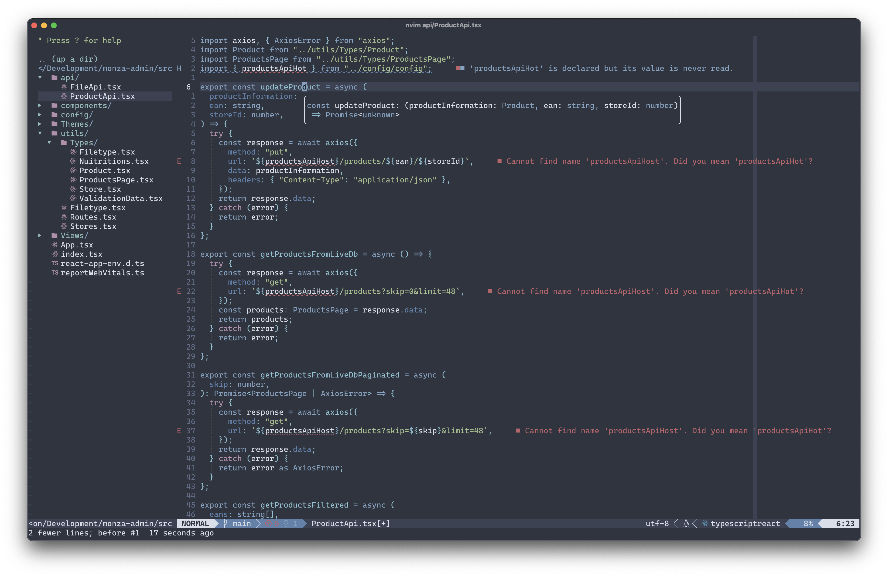

# Neovim Lua Config



## Installation

### Install Neovim (0.6+ required for Native LSP support and GitHub Copilot)

- Mac

```
brew install neovim
```

- Linux

```
sudo apt install neovim
```

#### Make sure that the folder ```nvim``` exists within your ```~/.config``` directory before proceeding, if not, create it:

```
mkdir ~/.config/nvim
```

#### Clone this repository 

This will clone the repository directly into your ```nvim config``` folder:
```
git clone https://github.com/DavidAEriksson/nvim-config.git ~/.config/nvim
```

### Package manager

The config uses Packer as the package manager. All installed packages can be found in `lua/packages.lua`. On clone you need to run `:PackerInstall` to install all dependencies.

GitHub Copilot should be installed directly:

```
git clone https://github.com/github/copilot.vim.git \
  ~/.config/nvim/pack/github/start/copilot.vim
```

### Install language servers (LSP)

Additional language servers can be installed through `nvim-lsp-installer` and invoking `LspInstall <server>`. In `lua/lsp.lua` servers are dynamically handled through this block of Lua script:

```
lsp_installer.on_server_ready(function(server)
    local opts = {}
    local capabilities = require('cmp_nvim_lsp').update_capabilities(vim.lsp.protocol.make_client_capabilities())
    capabilities = capabilities
    server:setup(opts)
end)
```
